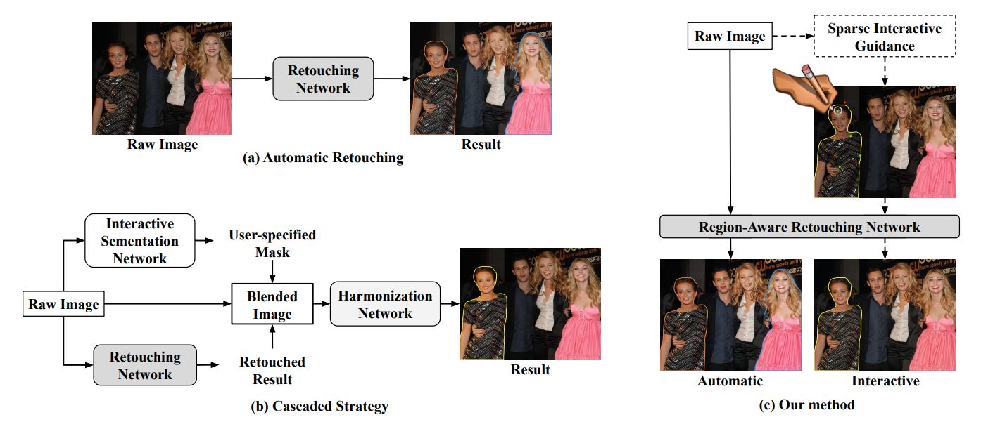
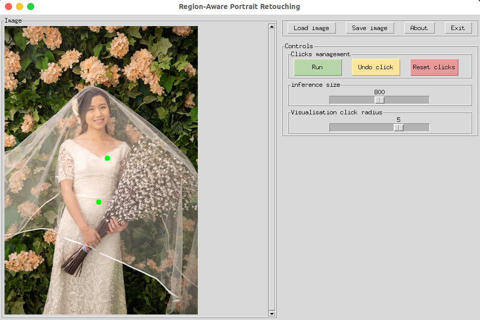

# Region-Aware Portrait Retouching with Sparse Interactive Guidance
[Huimin Zeng](https://ZeldaM1.github.io/), [Jie Huang](https://kevinj-huang.github.io/), [Jiacheng Li](http://home.ustc.edu.cn/~jclee/), [Zhiwei Xiong](http://staff.ustc.edu.cn/~zwxiong/)

IEEE Transactions on Multimedia

[[Paper]](https://ieeexplore.ieee.org/document/10081407) [[arXiv]](https://arxiv.org/abs/2304.04017) 
 
#  Comming soon
 
## Overview
 
 

## Prerequisites
- Python 3.7
- Pytorch 1.8.1

To get started, first please clone the repo
```
git clone https://github.com/ZeldaM1/interactive_portrat_retouching.git
```
You can use our docker by running the following commands:
```
docker pull registry.cn-hangzhou.aliyuncs.com/zenghuimin/zhm_docker:py37-torch18
```

## Quick start
You can try our Demo!
1. Download the [pre-trained models](https://drive.google.com/drive/folders/1qvyTDmfIMClkOkzuWC00K5ceU6HOOg6z?usp=sharing). 
2. Put the downloaded pre-trained models to `./ckpt`.
3. Run the interactive portrait retouching demo

```bash
cd code
python demo.py  --checkpoint ckpt/c_ckpt.pth
```
If everything works, you will find an interactive GUI like:

 

You can also retouch your own portrait. All you need to do is to change the input and output paths, have fun!

 
## Training
First, please prepare the dataset for training.
1. Please download [PPR10K dataset](https://github.com/csjliang/PPR10K) in the official link.
2. Download the annotations for each instance [here](https://drive.google.com/drive/folders/1qvyTDmfIMClkOkzuWC00K5ceU6HOOg6z?usp=sharing).
3. Unzip images and anntations of PPR10K to `./dataset`, organize them as follows:
```
dataset
├── train 
│   ├── masks_360p
│   ├── masks_ins_360p
│   ├── source
│   ├── target_a
│   ├── target_b
│   └── target_c
└── val
    ├── masks_360p
    ├── masks_ins_360p
    ├── source
    ├── target_a
    ├── target_b
    └── target_c
```


Our codes adopt a three-stage training process as follows. 
First we train the automatic branch.
```bash
cd code
python train.py -opt options/train/c_s1_base.yml
```
Then train the interactive branch.
```bash
python  train.py  -opt_base   options/train/c_s1_base.yml  -opt   options/train/c_s2_inter.yml
```

Third, train the joint model. 
```bash
python  train_dual_branch.py  -opt_base   options/train/c_s1_base.yml   -opt options/train/c_s3_joint.yml
 ```
## Testing
```
cd code
python test.py  -opt /disk2/zenghm/CSRNet/codes_share_v1_inter/options/test/auto/c_s3_joint.yml  -model ./ckpt/c_ckpt.pth  --save_results # automatic retouching evaluation
python test.py  -opt /disk2/zenghm/CSRNet/codes_share_v1_inter/options/test/inter/c_s3_joint.yml  -model ./ckpt/c_ckpt.pth  --save_results  # interactive retouching evaluation
```
## Citation
If our work inspires your research or some part of the codes are useful for your work, please cite our paper:
```bibtex
@ARTICLE{10081407,
  author={Zeng, Huimin and Huang, Jie and Li, Jiacheng and Xiong, Zhiwei},
  journal={IEEE Transactions on Multimedia}, 
  title={Region-Aware Portrait Retouching with Sparse Interactive Guidance}, 
  year={2023},
  volume={},
  number={},
  pages={1-13},
  doi={10.1109/TMM.2023.3262185}}
```

## Contact
If you have any questions, please contact us via 
- zenghuimin@mail.ustc.edu.cn

## Acknowledgement
Some parts of this repo are based on [RITM](https://github.com/SamsungLabs/ritm_interactive_segmentation) and [CSRNet](https://github.com/hejingwenhejingwen/CSRNet).  